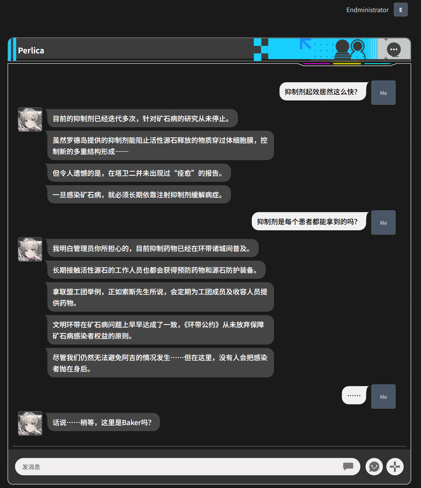

# Baker

基于 Dioxus 0.7 的会话编辑与回放界面，面向聊天场景的 UI 原型与交互演示。
这个项目旨在还原《明日方舟：终末地》中 Baker 的聊天功能，当然还有一点功能没实现的……留作以后再完善。

## 功能概览

- 会话与联系人管理：选择会话、发起新会话、配置干员列表
- 消息编辑能力：发送、编辑、删除、在指定位置插入
- 状态行支持：以独立状态行展示，可编辑、删除、插入
- 回放能力：从指定消息起开始回放
- 主题与资料：会话头样式切换、背景模式设置、用户资料配置
- 本地持久化存储：Web 使用 LocalStorage，非 wasm 目标使用本地 JSON 文件

## TO-DO LIST

- [x] 添加对于群组的支持
- [x] 图片消息支持
- [x] 对于消息的 reaction 支持
- [ ] 表情包的消息支持
- ……

## 使用的技术

- Rust 2021
- Dioxus 0.7

## 运行

```bash
cargo install dioxus-cli
dx serve --platform web
# ...If you want to run it on desktop platform, you can use the following command:
dx serve --platform desktop
```

## 问题、建议

如果你在使用这个软件时遇到任何 bug 或者对软件有啥建议，请在 Github 上提交 Issue，谢谢！

## 展示


